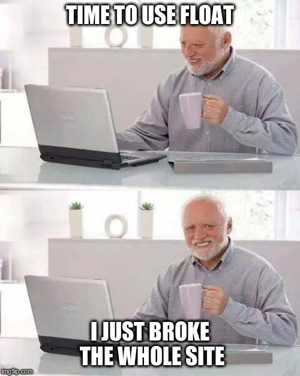

# Flexbox

## Resources

### Read or watch:

-   [A Complete Guide to Flexbox | CSS-Tricks](https://css-tricks.com/snippets/css/a-guide-to-flexbox/)
-   [Flexbox Froggy - A game for learning CSS flexbox](http://flexboxfroggy.com/)
-   [Flexbox Defense](https://intranet.hbtn.io/rltoken/Ap-otFRTGW5_f4osObvsGg)
-   [Flexbox Cheatsheet](https://intranet.hbtn.io/rltoken/yF52KbGYXTvQHznQFaqiUQ)
-   [CSS Flexible Box Layout - CSS: Cascading Style Sheets | MDN](https://intranet.hbtn.io/rltoken/S2mdsx4KqlOramBgpVJIcA)
-   [afonsopacifer/awesome-flexbox: A curated list of CSS Flexible Box Layout Module or only Flexbox.](https://intranet.hbtn.io/rltoken/bKqIGGlGouQVcNpO6mb3yA)
-   [Build with Flexbox](https://intranet.hbtn.io/rltoken/fNfq2XrH6D0OFpXZZA6n_w)
-   [Flexplorer](https://intranet.hbtn.io/rltoken/pARdLpfpniuVj6s_R3hjEw)
-   [CSS Flexible Box Layout Module Level 1](https://intranet.hbtn.io/rltoken/qmuM8ZPOLSuPg2XR2zy5Jg)
-   [FLEX: A simple visual cheatsheet for flexbox](https://intranet.hbtn.io/rltoken/bZj3TIFXL07zC0lu-UO0aQ)

### Learning Objectives

At the end of this project, you are expected to be able to explain to anyone, without the help of Google:

- What is Flexbox?
- How to convert float positioning to a flex display
- How to horizontally and vertically align elements using Flexbox
- The difference between the main and cross axes
- Properties that work on flex elements vs flex container
- Shorthands for flex
- How to create a new page with flex in mind

### Requirements

-    Allowed editors: vi, vim, emacs
-    A README.md at the root of the project directory is mandatory
-    All of your code will be executed on Ubuntu 18.04 using Python 3.7.x
-    All of your files should end with a new line

